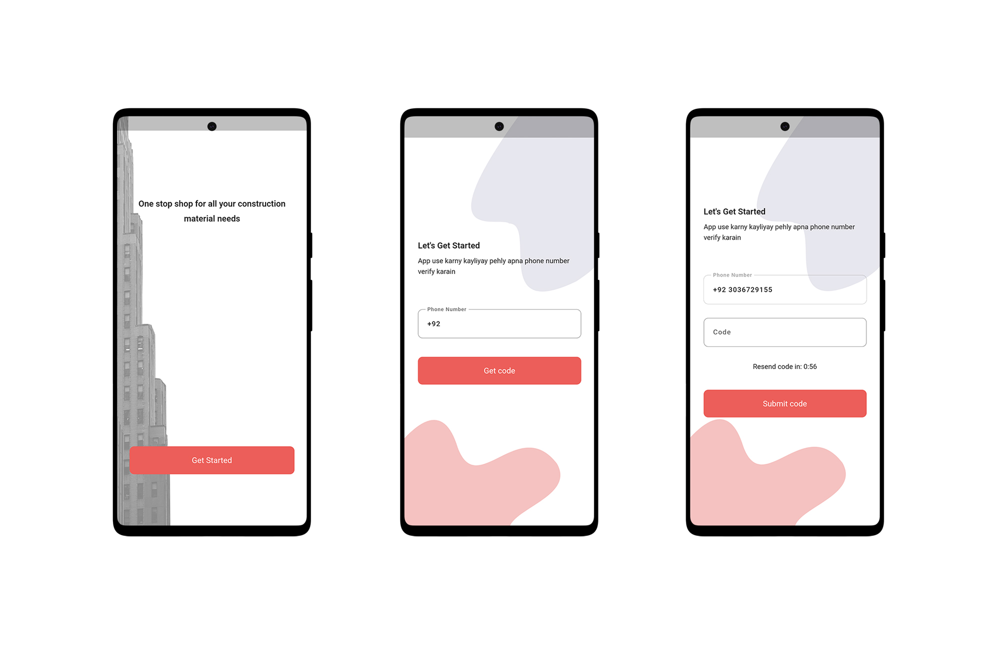
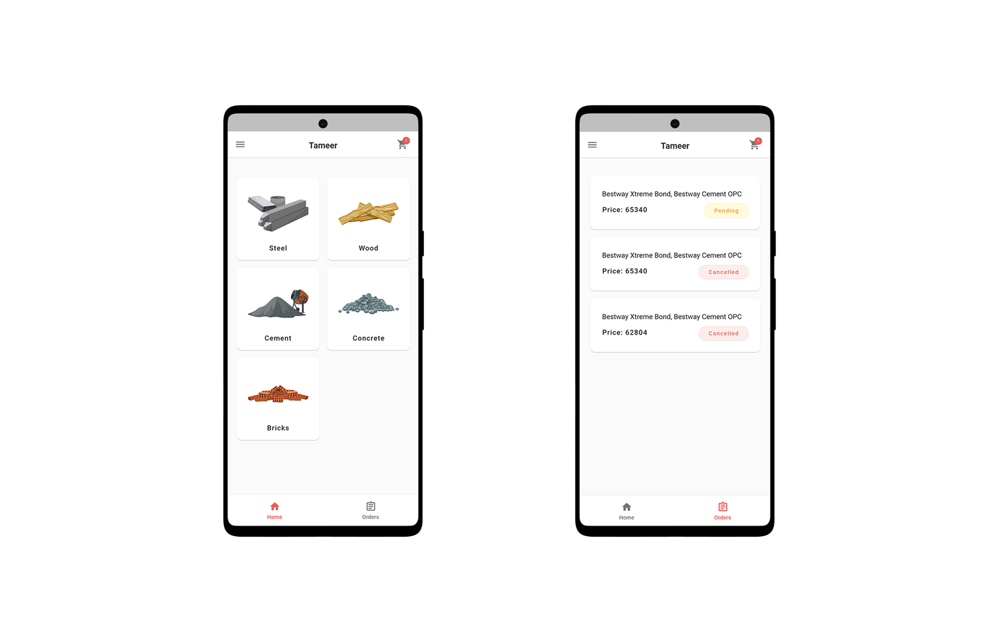
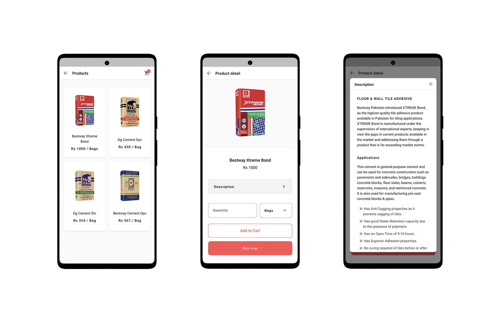
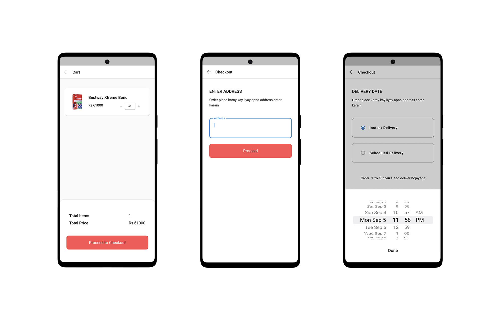
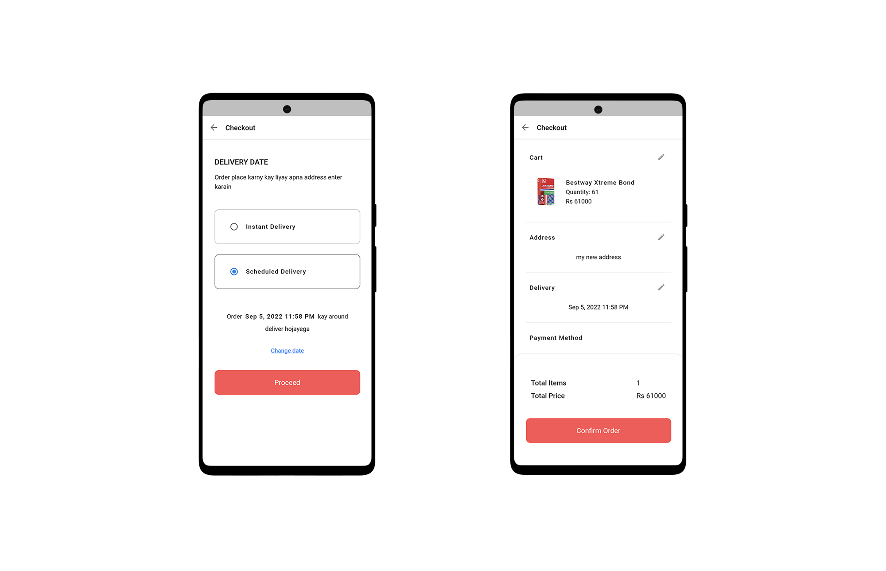

# Tameer - Construction Materials Marketplace

A comprehensive mobile marketplace for construction materials built with Flutter, featuring a clean UI and robust functionality.

  

## Features

### User Authentication

- Secure user authentication powered by Firebase
- Beautifully designed login and signup screens with custom wave patterns
- User profile management

### Product Shopping Experience

- Categorized construction materials browsing
- Detailed product pages with comprehensive information
- Add to cart functionality with quantity management
- Buy now option for immediate purchase

### Order Management

- Complete order history tracking
- Various order status indications with color coding
- Order reordering capability for repeat purchases

### Cart & Checkout Process

- Real-time cart management
- Address input and storage
- Flexible delivery options including scheduled deliveries
- Streamlined checkout process

  
  
<em>Home Screen with Categories</em>

  
  
<em>Product Detail and Description</em>

  
  
<em>Cart Management and Address Input</em>

  
  
<em>Delivery Options and Checkout</em>

## Technical Stack

### Frontend

- Flutter SDK for cross-platform development
- Custom UI components with Material Design principles
- Custom Painters for wave pattern backgrounds
- Responsive layouts with GridView and ListView

### State Management

- BLoC pattern using flutter_bloc
- Clean architecture with separation into presentation, logic, and data layers

### Backend & Services

- Firebase Authentication for user management
- Cloud Firestore for database storage
- Hive for local storage of user profiles

### Key Dependencies

- firebase_core, firebase_auth, cloud_firestore - Backend services
- flutter_bloc, equatable - State management
- hive, hive_flutter - Local data persistence
- cached_network_image - Efficient image loading and caching
- google_maps_flutter - Location services integration
- fluttertoast - User feedback notifications
- expandable - Collapsible UI components
